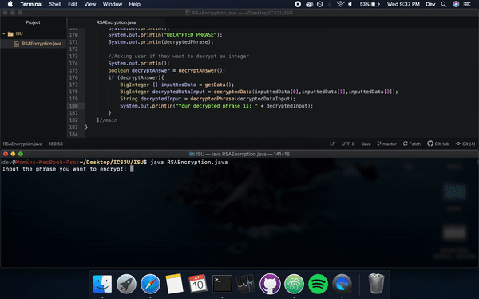

<!-- PROJECT SHIELDS -->
<!--
*** I'm using markdown "reference style" links for readability.
*** Reference links are enclosed in brackets [ ] instead of parentheses ( ).
*** See the bottom of this document for the declaration of the reference variables
*** for contributors-url, forks-url, etc. This is an optional, concise syntax you may use.
*** https://www.markdownguide.org/basic-syntax/#reference-style-links
-->

<!-- PROJECT LOGO -->
<br />
<p align="center">
  <a href="https://github.com/Momin-C/CS-ISU">
    
  </a>

  <h3 align="center">YOUR_TITLE</h3>

  <p align="center">
    YOUR_SHORT_DESCRIPTION
    <br />
    <a href="https://github.com/Momin-C/CS-ISU"><strong>Explore the docs »</strong></a>
    <br />
    <br />
    <a href="https://github.com/Momin-C/CS-ISU">View Demo</a>
    ·
    <a href="https://github.com/Momin-C/CS-ISU/issues">CS-ISUrt Bug</a>
    ·
    <a href="https://github.com/Momin-C/CS-ISU/issues">Request Feature</a>
  </p>
</p>


<!-- TABLE OF CONTENTS -->
## Table of Contents

* [About the Project](#about-the-project)
* [Usage](#usage)
* [Roadmap](#roadmap)
  * [Packages](#packages)
  * [Class Methods](#class-methods)
  * [Main Method](#main-method)
* [Videos](#videos)
* [Contact](#contact)


<!-- ABOUT THE PROJECT -->
## About The Project

[![Product Name Screen Shot][product-screenshot]](https://example.com)

This project uses one of the most secure and common methods of encryption (RSA) to encrypt a given user input. It also asks the user if they want to decrypt a given input. The next sections explain how the encryption works.

<!-- USAGE -->
## Usage

To use this file and test its encryption simply clone the CS-ISU onto your computer and run it using an IDE or a compiler of your choice

```sh
git clone https://github.com/Momin-C/CS-ISU.git
```

<!-- ROADMAP -->
## Roadmap

<!-- PACKAGES -->
### Packages

To securely encrypt the given input, three packages/modules needed to be imported

```java
import java.util.*;
import java.math.BigInteger;
import java.security.SecureRandom;
```

To learn more about each package/module, their documentation is in the links below

* [java.util](https://docs.oracle.com/javase/8/docs/api/java/util/package-summary.html)
* [java.math.BigInteger](https://docs.oracle.com/javase/7/docs/api/java/math/BigInteger.html)
* [java.security.SecureRandom](https://docs.oracle.com/javase/8/docs/api/java/security/SecureRandom.html)

<!-- CLASS METHODS -->
### Class Methods

This section will explain in detail how the RSA encryption works

RSA encryption bases itself around prime numbers. the method twoPrimes() generates a secure random number using the java.security.secureRandom package. Big integer is used to create two prime numbers due to complex operations taking place that no data set can handle. These two prime numbers are selected and placed in a BigInteger array and then returned. Code can be seen below.

```java
public static BigInteger [] twoPrimes() {
    /* This method selects two random prime numbers in the length of 512 bits
     * appends these to a BigInteger array and returns it */
    Random rand = new SecureRandom();
    BigInteger primeOne = BigInteger.probablePrime(512, rand);
    BigInteger primeTwo = BigInteger.probablePrime(512, rand);
    BigInteger [] primesSelected = {primeOne,primeTwo};
    return primesSelected;
}//twoPrimes
```

RSA encryption involves the use of two keys, public and private. Aspects of the public key are used to encrypt the message and the private key is used to decrypt the messsage. The public key consists of 'n' which is the product of both the prime numbers and 'e' which is a small exponent. The private and public key aspects are determined below and the

```java
public static BigInteger publicKey(BigInteger [] primes){
    /* This method calculates the publicKey by obtaining the two primes
     * selected in the twoPrimes() method and multiplying them by eachother
     * this value is then returned */
	BigInteger publicKey = primes[0].multiply(primes[1]);
	return publicKey;
}//publicKey

public static BigInteger privateKeyNum(BigInteger [] primes){
    /* This method calculates "phi" or the private key number by obtaining
     * the two primes selected in twoPrimes(), subtracting each of them by 1 and multiplying
     * them by eachother and returns this value */
	BigInteger privateKeyNum = primes[0].subtract(BigInteger.ONE).multiply(primes[1].subtract(BigInteger.ONE));
	return privateKeyNum;
}//privateKeyNum

public static BigInteger smallExponent(BigInteger [] primes, BigInteger privateKeyNum){
    /* This method produces a small exponent which will be used to encrypt the string, it obtains
     * the two prime numbers and the private key number as its parameters, a random
	 * number is then generated such that it is greater than 1, is less than the
     * private key number and its greatest GCF with the private key number is 1,
     * this value is then returned */
    BigInteger smallExponent;
    do {
        int num = (int)(privateKeyNum.intValue()*(Math.random()));
        smallExponent = BigInteger.valueOf(num);
    }
    while (smallExponent.compareTo(BigInteger.ONE) <= 0 || smallExponent.compareTo(privateKeyNum) >= 0 || !smallExponent.gcd(privateKeyNum).equals(BigInteger.ONE));
    return smallExponent;
}//smallExponent

public static BigInteger privateKey(BigInteger smallExponent, BigInteger privateKeyNum){
    /* This method obtains the small exponent and the private key number as its parameters
     * to calculate the private key by inversing the small exponent and modding
     * it by the private key number and returns it */
    BigInteger privateKey = smallExponent.modInverse(privateKeyNum);
    return privateKey;
}//privateKey
```

Input is then received from the user in the method getInput(). This string value is then converted into numbers in the numericalValue() method by converting each character into its ASCII code and adding 100 to it. This makes sure that each character's code is 3 digits making it to parse and convert back to string.

```java
public static String getInput(){
    /* This method asks the user to input a string they want to encrypt and returns it */
    System.out.print("Input the phrase you want to encrypt: ");
    String phrase = input.nextLine();
    return phrase;
}//getInput

public static BigInteger numericalValue(String phrase) {
    /* This method obtains the user's string they want to encrypt as its parameter, obtains its
     * ASCII code, appens that to a string and then converts the string to a BigInteger
     * which is then returned. The ASCII code has 100 added to it so each character has
     * three ASCII values making it able to decrypt */
    String numString = "";
    for (int index = 0; index<phrase.length(); index++){
        char indexCharacter = phrase.charAt(index);
        int alphaValue = (int)indexCharacter+100;
        numString+=alphaValue;
    }
    BigInteger num = new BigInteger(numString);
    return num;
}//numericalValue
```
Once these keys are collected, the string converted into a BigInteger is then encrypted.
```java
public static BigInteger encryptedData(BigInteger numericalValue, BigInteger smallExponent, BigInteger publicKey){
    /* This method obtains the numericalValue of the string, the small exponent
     * and the public key, it then encrypts the data by following the formula numerical
     * value ^ small exponent modulo public Key and returns this encrypted data */
    BigInteger encryptedData = numericalValue.modPow(smallExponent,publicKey);
    return encryptedData;
}//encryptedData
```
The data is then decrypted as well and converted back to string format
```java
public static BigInteger decryptedData(BigInteger encryptedData, BigInteger privateKey, BigInteger publicKey){
    /* This method obtains the encrypted data, the private key and the public key and
     * decrypts the data by raising the encrypted data to the power of the private key
     * and then modding it by the public key, this value is then returned */
    BigInteger decryptedData = encryptedData.modPow(privateKey,publicKey);
    return decryptedData;
}//decryptedData

public static String decryptedPhrase(BigInteger decryptedData){
    /* This method obtains the decrypted data and converts the decryptedData
     * to the original String by comparing the ASCII values to their respective
     * characters, this is subtracted by 100 as 100 was previously added and then
     * this string is returned */
    String decrypted = String.valueOf(decryptedData);
    String word = "";
    for (int index = 0; index < decrypted.length(); index+=3){
        int num = Integer.valueOf(decrypted.substring(index,index+3)) -100;
        word+=(char)num;
    }
    return word;
}//decryptedPhrase
```
User input decryption uses the two decryption methods as well but includes these two methods to get the keys from the user
```java
public static boolean decryptAnswer(){
    /* This method asks a user if they want to decrypt a given input
     * and returns this boolean value */
    System.out.println("Do you want the program to decrypt a given input? (true or false): ");
    boolean answer = input.nextBoolean();
    return answer;
}//decryptAnswer

public static BigInteger [] getData(){
    /* This method obtains the big integer to decrypt, the public
     * and private key then returns these three in a BigInteger array */
    System.out.println();
    System.out.println("Input BigInteger to decrypt: ");
    BigInteger toDecrypt = input.nextBigInteger();

    System.out.println();
    System.out.println("Input private key: ");
    BigInteger privateKey = input.nextBigInteger();

    System.out.println();
    System.out.println("Input public key: ");
    BigInteger publicKey = input.nextBigInteger();

    BigInteger [] data = {toDecrypt,privateKey,publicKey};
    return data;
}//getData
```
<!-- MAIN METHOD -->
### Main Method

The main method calls every method and assigns their return values to appropriate variables, the relevant variables are then printed. The main method also asks the user if they want to decrypt a given input, if true then the methods getData, decryptedData and decryptedPhrase are executed.
```java
public static void main(String args[]) {
    /* The main method calls every method and assigns their values to variables */

    //Calling all methods
    BigInteger [] primes = twoPrimes();
    BigInteger publicKey = publicKey(primes);
    BigInteger privateKeyNum = privateKeyNum(primes);
    BigInteger smallExponent = smallExponent(primes,privateKeyNum);
    String phrase = getInput();
    BigInteger privateKey = privateKey(smallExponent,privateKeyNum);
    BigInteger numericalValue = numericalValue(phrase);
    BigInteger encryptedData = encryptedData(numericalValue,smallExponent,publicKey);
    BigInteger decryptedData = decryptedData(encryptedData,privateKey,publicKey);
    String decryptedPhrase = decryptedPhrase(decryptedData);

    //Printing out the values
    System.out.println();
    System.out.println("ENCRYPTED:");
    System.out.println(encryptedData);

    System.out.println();
    System.out.println("PUBLIC KEY");
    System.out.println(publicKey);

    System.out.println();
    System.out.println("PRIVATE KEY");
    System.out.println(privateKey);

    System.out.println();
    System.out.println("DECRYPTED PHRASE");
    System.out.println(decryptedPhrase);

    //Asking user if they want to decrypt an integer
    System.out.println();
    boolean decryptAnswer = decryptAnswer();
    if (decryptAnswer){
        BigInteger [] inputtedData = getData();
        BigInteger decryptedDataInput = decryptedData(inputtedData[0],inputtedData[1],inputtedData[2]);
        String decryptedInput = decryptedPhrase(decryptedDataInput);
        System.out.println("Your decrypted phrase is: " + decryptedInput);
    }
}//main

```

<!-- VIDEOS  -->
## Videos

Inputting "true" to the final prompt


Inputting "false" to the final prompt


<!-- CONTACT -->
## Contact

Your Name - [@momin_c](https://twitter.com/momin_c) - hellomomins@yahoo.com

Project Link: [https://github.com/Momin-C/CS-ISU](https://github.com/Momin-C/CS-ISU)


<!-- MARKDOWN LINKS & IMAGES -->
[product-screenshot]: images/screenshot.png
